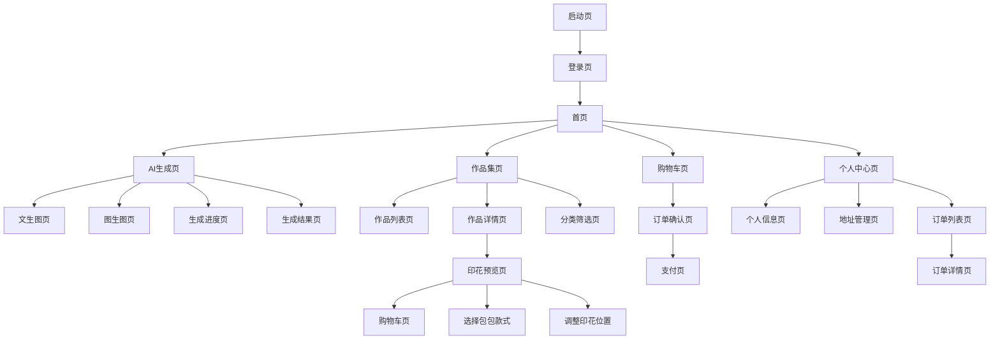
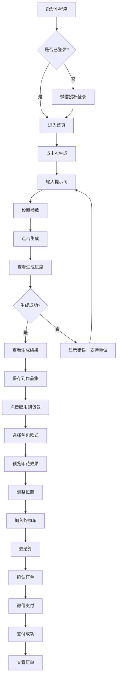
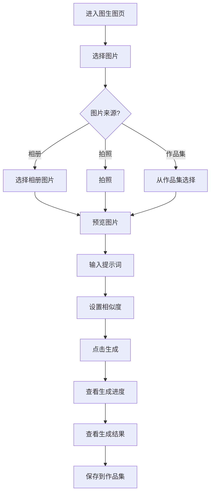
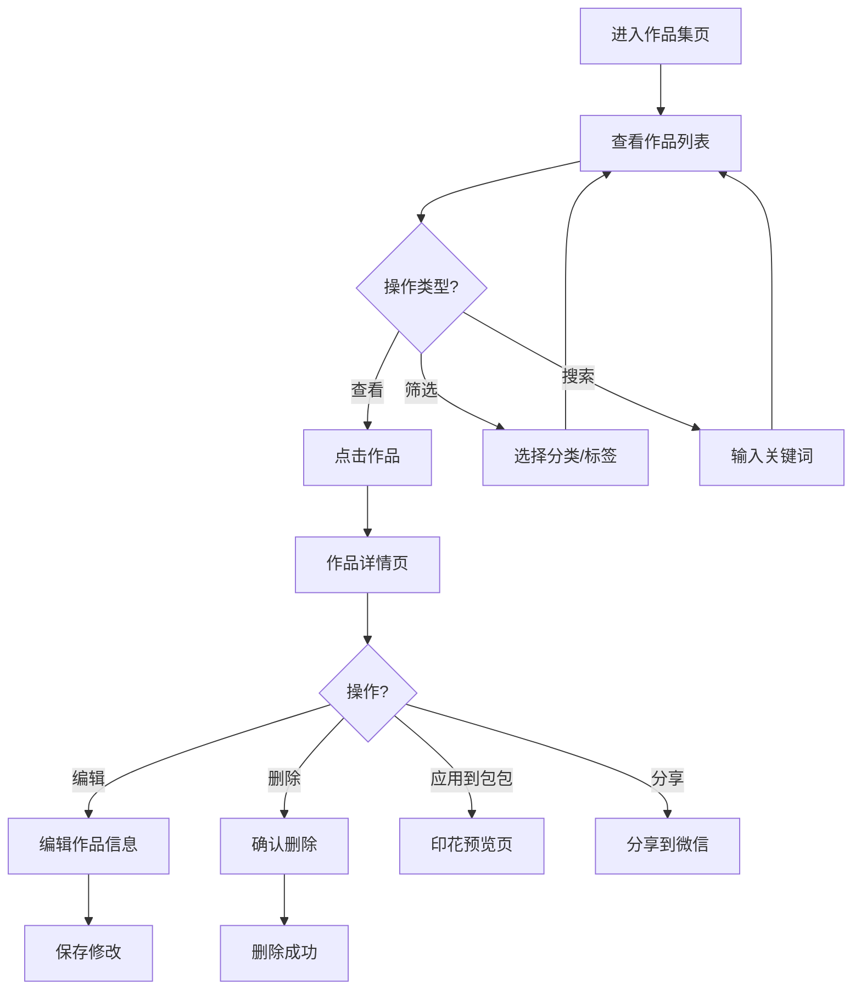
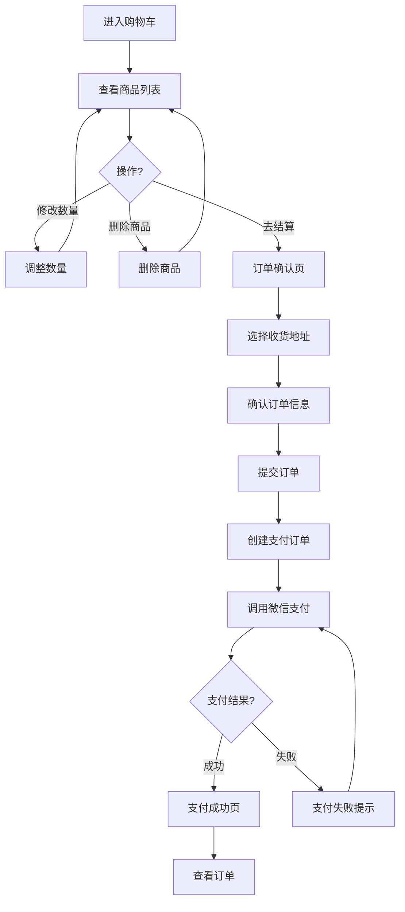

# AI印花电商小程序 UI/UX Specification

## Introduction

本文档定义了AI印花电商小程序的用户体验目标、信息架构、用户流程和视觉设计规范。它作为视觉设计和前端开发的基础，确保提供一致且以用户为中心的体验。

本文档基于PRD文档和项目简介创建，重点关注P0和P1功能的UI/UX设计。

### Overall UX Goals & Principles

#### Target User Personas

**主要用户：年轻时尚消费者**
- 年龄：18-35岁
- 特征：追求个性化、熟悉移动端操作、愿意尝试新技术
- 需求：快速生成个性化设计、直观预览效果、便捷购买流程
- 使用场景：想要独特包包、设计礼物、表达个人风格

**次要用户：设计师和创作者**
- 特征：需要快速验证设计效果、小批量定制
- 需求：高效的工具、专业的功能

#### Usability Goals

1. **易学性**：新用户能在5分钟内完成首次图片生成
2. **效率**：熟练用户能在3步内完成从生成到购买
3. **错误预防**：关键操作有确认提示，防止误操作
4. **可记忆性**：界面布局清晰，用户返回时无需重新学习
5. **满意度**：生成流程流畅，预览效果直观，购买体验愉悦

#### Design Principles

1. **简洁优先** - 突出核心功能，减少认知负担
2. **即时反馈** - 每个操作都有明确的视觉反馈
3. **渐进式披露** - 只在需要时显示相关信息
4. **一致性** - 使用统一的UI模式和交互方式
5. **视觉愉悦** - 现代、时尚的设计风格，符合目标用户审美

### Change Log

| Date | Version | Description | Author |
|------|---------|-------------|--------|
| 2024-12-14 | 1.0 | 初始前端规范创建 | UX Expert |

## Information Architecture (IA)

### Site Map / Screen Inventory

### Navigation Structure

**Primary Navigation（底部Tab导航）：**
- 首页：AI生成入口、热门推荐
- 作品集：用户创作的作品列表
- 购物车：待结算的商品
- 我的：个人中心、设置

**Secondary Navigation：**
- 顶部导航栏：页面标题、返回按钮、操作按钮
- 侧边栏：个人中心菜单（可选）

**Breadcrumb Strategy：**
- 小程序环境，使用顶部导航栏显示当前页面
- 深层页面使用返回按钮导航

## User Flows

### Flow 1: 新用户首次生成和购买流程

**User Goal:** 新用户完成从注册到首次购买的完整流程

**Entry Points:** 小程序启动页

**Success Criteria:** 用户成功生成图片、预览效果、完成购买

**Edge Cases & Error Handling:**
- 生成失败：显示错误提示，提供重试按钮
- 网络错误：显示网络错误提示，支持重试
- 支付失败：显示支付失败原因，支持重新支付
- 登录失败：显示登录错误，引导重新授权

**Notes:** 这是核心用户流程，需要确保每个步骤都有清晰的引导和反馈。

### Flow 2: 图生图流程

**User Goal:** 用户基于上传的图片生成新作品

**Entry Points:** AI生成页、作品详情页

**Success Criteria:** 用户成功上传图片并生成新作品

**Edge Cases & Error Handling:**
- 图片格式不支持：提示支持的格式
- 图片过大：自动压缩或提示压缩
- 上传失败：显示错误，支持重新上传

### Flow 3: 作品管理流程

**User Goal:** 用户管理自己的作品集

**Entry Points:** 作品集页

**Success Criteria:** 用户能够查看、编辑、删除作品

**Edge Cases & Error Handling:**
- 作品列表为空：显示空状态提示
- 删除失败：显示错误提示
- 编辑失败：显示错误，保留原数据

### Flow 4: 购物和支付流程

**User Goal:** 用户完成商品购买和支付

**Entry Points:** 购物车页、作品详情页

**Success Criteria:** 用户成功完成支付

**Edge Cases & Error Handling:**
- 购物车为空：显示空状态，引导去生成作品
- 地址未设置：引导添加地址
- 支付超时：提示超时，支持重新支付
- 库存不足：提示库存不足，更新购物车

## Wireframes & Mockups

### Design Files

**主要设计工具：** Figma（推荐）或 Sketch

**设计文件结构：**
- 设计系统（Design System）
- 页面设计（Pages）
- 组件库（Components）
- 交互原型（Prototypes）

### Key Screen Layouts

#### 1. 首页

**Purpose:** 展示AI生成入口和热门推荐，引导用户开始创作

**Key Elements:**
- 顶部Banner：品牌展示或活动推广
- AI生成入口：大按钮，突出核心功能
- 热门作品推荐：横向滚动卡片列表
- 底部Tab导航

**Interaction Notes:**
- 点击AI生成入口跳转到生成页
- 热门作品卡片可点击查看详情
- 支持下拉刷新

**Design File Reference:** `pages/home.figma`

#### 2. AI生成页（文生图）

**Purpose:** 用户输入提示词和设置参数，发起图片生成

**Key Elements:**
- 顶部导航：返回按钮、页面标题
- 提示词输入框：多行文本输入，占位符提示
- 参数设置面板：
  - 尺寸选择：正方形、横版、竖版（单选）
  - 风格选择：写实、插画、抽象、水彩等（单选或多选）
- 生成按钮：主要操作按钮，禁用状态（提示词为空时）

**Interaction Notes:**
- 输入框支持多行输入，自动调整高度
- 参数选择使用卡片或按钮组
- 生成按钮点击后跳转到进度页
- 参数验证：提示词不能为空

**Design File Reference:** `pages/generate-text.figma`

#### 3. 生成进度页

**Purpose:** 显示生成进度，让用户了解等待时间

**Key Elements:**
- 进度条：显示生成进度（0-100%）
- 预计剩余时间：动态更新
- 加载动画：旋转或进度动画
- 取消按钮：可选

**Interaction Notes:**
- 自动轮询后端获取进度
- 进度更新时动画过渡
- 完成后自动跳转到结果页
- 失败时显示错误信息和重试按钮

**Design File Reference:** `pages/generating.figma`

#### 4. 生成结果页

**Purpose:** 展示生成的图片，支持保存和后续操作

**Key Elements:**
- 大图展示：生成的图片，支持缩放
- 操作按钮：
  - 保存到作品集
  - 重新生成
  - 应用到包包
  - 分享

**Interaction Notes:**
- 图片支持双击放大查看
- 保存成功后显示成功提示
- 点击应用到包包跳转到预览页

**Design File Reference:** `pages/result.figma`

#### 5. 作品集页

**Purpose:** 展示用户的所有作品，支持浏览和管理

**Key Elements:**
- 顶部筛选栏：分类、标签筛选（P1）
- 作品网格：2列或3列网格布局
- 作品卡片：缩略图、标题、标签
- 空状态：无作品时的提示

**Interaction Notes:**
- 支持下拉刷新
- 支持上拉加载更多
- 点击作品卡片跳转到详情页
- 长按显示操作菜单（删除、编辑等）

**Design File Reference:** `pages/works.figma`

#### 6. 作品详情页

**Purpose:** 展示作品完整信息，支持编辑和管理

**Key Elements:**
- 大图展示：作品图片，支持缩放
- 作品信息：标题、描述、标签、创建时间
- 操作按钮：
  - 编辑
  - 删除
  - 应用到包包
  - 分享

**Interaction Notes:**
- 编辑时显示输入框
- 删除时显示确认对话框
- 应用到包包跳转到预览页

**Design File Reference:** `pages/work-detail.figma`

#### 7. 印花预览页

**Purpose:** 预览作品在包包上的效果，支持调整和加入购物车

**Key Elements:**
- 包包预览区：显示包包图片和叠加的印花
- 款式选择：包包类型选择（卡片或下拉）
- 规格选择：颜色、尺寸选择
- 位置调整：拖拽或点击调整印花位置
- 加入购物车按钮

**Interaction Notes:**
- 实时预览效果
- 支持拖拽调整位置
- 支持缩放调整大小（可选）
- 加入购物车后显示成功提示

**Design File Reference:** `pages/preview.figma`

#### 8. 购物车页

**Purpose:** 展示待结算的商品，支持编辑和删除

**Key Elements:**
- 商品列表：每个商品显示作品预览、商品信息、规格、数量、价格
- 数量调整：+/-按钮
- 删除按钮：滑动删除或点击删除
- 底部结算栏：总价、去结算按钮

**Interaction Notes:**
- 修改数量实时更新总价
- 删除商品显示确认提示
- 空状态显示引导信息
- 去结算跳转到订单确认页

**Design File Reference:** `pages/cart.figma`

#### 9. 订单确认页

**Purpose:** 确认订单信息和收货地址

**Key Elements:**
- 商品列表：订单商品信息
- 收货地址：显示或选择地址
- 价格明细：商品总价、运费、实付金额
- 提交订单按钮

**Interaction Notes:**
- 点击地址可跳转到地址管理页
- 提交订单后跳转到支付页

**Design File Reference:** `pages/order-confirm.figma`

#### 10. 支付页

**Purpose:** 完成微信支付

**Key Elements:**
- 订单信息：订单号、金额
- 支付按钮：调用微信支付
- 支付说明：支付流程说明

**Interaction Notes:**
- 自动调用微信支付
- 支付成功后跳转到订单详情
- 支付失败显示错误提示

**Design File Reference:** `pages/payment.figma`

#### 11. 个人中心页

**Purpose:** 用户个人信息和功能入口

**Key Elements:**
- 用户信息：头像、昵称
- 订单统计：待支付、待收货等数量
- 功能入口：
  - 我的订单
  - 收货地址
  - 个人信息
  - 设置

**Interaction Notes:**
- 点击订单统计跳转到订单列表
- 各功能入口跳转到对应页面

**Design File Reference:** `pages/profile.figma`

## Component Library / Design System

### Design System Approach

**使用uView UI组件库作为基础设计系统**

uView UI提供了丰富的组件和设计规范，我们将在此基础上进行定制化，确保：
- 保持组件库的一致性
- 根据品牌风格进行颜色和样式定制
- 扩展自定义组件以满足特定需求

### Core Components

#### 1. Button（按钮）

**Purpose:** 执行主要操作

**Variants:**
- Primary：主要操作（生成、提交订单等）
- Secondary：次要操作（取消、返回等）
- Text：文本按钮（链接样式）

**States:**
- Default：默认状态
- Hover：悬停状态（小程序中为点击态）
- Disabled：禁用状态
- Loading：加载状态

**Usage Guidelines:**
- 主要操作使用Primary按钮
- 按钮文字清晰明确，避免使用"确定"等模糊词汇
- 禁用状态要有明显的视觉区别

#### 2. Card（卡片）

**Purpose:** 展示作品、商品等信息

**Variants:**
- Work Card：作品卡片
- Product Card：商品卡片
- Order Card：订单卡片

**States:**
- Default：默认状态
- Selected：选中状态
- Loading：加载状态（骨架屏）

**Usage Guidelines:**
- 卡片要有明确的边界和阴影
- 内容布局清晰，信息层次分明
- 支持点击和长按操作

#### 3. Input（输入框）

**Purpose:** 用户输入文本

**Variants:**
- Text：单行文本
- Textarea：多行文本
- Search：搜索框

**States:**
- Default：默认状态
- Focus：聚焦状态
- Error：错误状态
- Disabled：禁用状态

**Usage Guidelines:**
- 提供清晰的占位符提示
- 错误状态显示错误信息
- 支持清除按钮

#### 4. Modal（模态框）

**Purpose:** 显示重要信息或确认操作

**Variants:**
- Alert：提示框
- Confirm：确认框
- Custom：自定义内容

**Usage Guidelines:**
- 用于重要操作确认（删除、支付等）
- 提供明确的确认和取消按钮
- 遮罩层点击可关闭（可选）

#### 5. Loading（加载）

**Purpose:** 显示加载状态

**Variants:**
- Spinner：旋转加载
- Progress：进度条
- Skeleton：骨架屏

**Usage Guidelines:**
- 页面加载使用骨架屏
- 操作加载使用Spinner
- 进度加载使用Progress

#### 6. Tab（标签页）

**Purpose:** 切换不同内容区域

**Variants:**
- Top Tab：顶部标签
- Bottom Tab：底部导航

**Usage Guidelines:**
- 底部Tab用于主要导航
- 顶部Tab用于内容分类

#### 7. Image（图片）

**Purpose:** 展示图片内容

**Variants:**
- Thumbnail：缩略图
- Full：全图
- Avatar：头像

**Usage Guidelines:**
- 支持懒加载
- 加载失败显示占位图
- 支持点击放大查看

## Branding & Style Guide

### Visual Identity

**品牌风格：** 现代、简约、时尚

**设计理念：** 突出AI科技感，同时保持温暖友好的用户体验

### Color Palette

| Color Type | Hex Code | Usage |
|------------|----------|-------|
| Primary | #007AFF | 主要按钮、链接、强调元素 |
| Secondary | #5856D6 | 次要操作、辅助元素 |
| Accent | #FF9500 | 特殊强调、警告信息 |
| Success | #34C759 | 成功状态、确认信息 |
| Warning | #FF9500 | 警告信息 |
| Error | #FF3B30 | 错误信息、删除操作 |
| Neutral | #8E8E93 | 次要文本、边框 |
| Background | #F2F2F7 | 页面背景 |
| Card Background | #FFFFFF | 卡片背景 |

### Typography

**Font Families:**
- **Primary:** 系统默认字体（PingFang SC / Microsoft YaHei）
- **Monospace:** 代码、数字显示

**Type Scale:**

| Element | Size | Weight | Line Height |
|---------|------|--------|------------|
| H1 | 24px | Bold | 32px |
| H2 | 20px | Semibold | 28px |
| H3 | 18px | Semibold | 26px |
| Body | 16px | Regular | 24px |
| Small | 14px | Regular | 20px |
| Caption | 12px | Regular | 18px |

### Iconography

**Icon Library:** uView UI图标库 + 自定义图标

**Usage Guidelines:**
- 使用线性图标风格，保持一致性
- 图标大小：24px（标准）、32px（大）、16px（小）
- 图标颜色跟随文本颜色或使用主题色

### Spacing & Layout

**Grid System:**
- 页面边距：16px
- 卡片间距：12px
- 内容间距：8px、12px、16px、24px

**Spacing Scale:**
- xs: 4px
- sm: 8px
- md: 12px
- lg: 16px
- xl: 24px
- xxl: 32px

## Accessibility Requirements

### Compliance Target

**Standard:** 微信小程序无障碍规范（基础级别）

当前版本暂不包含完整的无障碍功能，但遵循以下基础原则：
- 颜色对比度符合基本要求
- 交互元素有明确的视觉反馈
- 文本大小可读

### Key Requirements

**Visual:**
- 颜色对比度：文本与背景对比度至少4.5:1
- 焦点指示：按钮和链接有明确的点击态
- 文本大小：最小字体12px

**Interaction:**
- 触摸目标：最小44x44px
- 手势操作：支持滑动、长按等常见手势
- 反馈：每个操作都有明确的视觉或触觉反馈

**Content:**
- 图片：重要图片提供文字说明
- 表单：所有输入框有明确的标签
- 错误：错误信息清晰明确

### Testing Strategy

- 视觉测试：检查颜色对比度和可读性
- 交互测试：验证所有交互元素可正常操作
- 设备测试：在不同设备上测试显示效果

## Responsiveness Strategy

### Breakpoints

| Breakpoint | Min Width | Max Width | Target Devices |
|------------|-----------|-----------|----------------|
| Mobile | 320px | 750px | 手机（主要目标） |
| Tablet | 751px | - | 平板（次要支持） |

**注意：** 小程序主要在手机端使用，但需要考虑不同屏幕尺寸的适配。

### Adaptation Patterns

**Layout Changes:**
- 小屏设备：单列布局，减少边距
- 大屏设备：保持单列，增加内容宽度

**Navigation Changes:**
- 所有设备使用相同的底部Tab导航
- 顶部导航栏自适应屏幕宽度

**Content Priority:**
- 核心功能始终可见
- 次要功能可折叠或隐藏

**Interaction Changes:**
- 触摸目标大小适配不同屏幕
- 手势操作保持一致

## Animation & Micro-interactions

### Motion Principles

1. **自然流畅** - 动画要符合物理规律，使用缓动函数
2. **适度使用** - 动画要有目的，不滥用
3. **性能优先** - 使用CSS动画或GPU加速，避免卡顿
4. **可访问性** - 尊重用户的动画偏好设置

### Key Animations

- **页面转场：** 滑动转场，持续时间300ms，ease-out
- **按钮点击：** 缩放反馈，持续时间150ms，ease-in-out
- **列表加载：** 淡入动画，持续时间200ms，ease-out
- **图片加载：** 淡入动画，持续时间300ms，ease-out
- **模态框：** 缩放+淡入，持续时间250ms，ease-out
- **进度条：** 平滑过渡，实时更新

## Performance Considerations

### Performance Goals

- **页面加载：** 首屏加载时间<2秒
- **交互响应：** 用户操作响应时间<100ms
- **动画FPS：** 保持60fps流畅度
- **图片加载：** 使用懒加载和压缩

### Design Strategies

1. **骨架屏：** 页面加载时显示骨架屏，提升感知性能
2. **图片优化：** 使用缩略图，点击后加载原图
3. **懒加载：** 列表内容使用懒加载
4. **预加载：** 关键页面预加载资源
5. **减少重绘：** 使用CSS动画而非JS动画

## Next Steps

### Immediate Actions

1. 在Figma中创建详细的设计稿
2. 建立设计系统组件库
3. 创建交互原型
4. 与开发团队评审设计规范
5. 准备设计资源（图标、图片等）

### Design Handoff Checklist

- [x] 所有用户流程已文档化
- [x] 组件清单已完成
- [x] 无障碍要求已定义
- [x] 响应式策略已明确
- [x] 品牌指南已整合
- [x] 性能目标已建立
- [ ] 详细设计稿已完成（待Figma设计）
- [ ] 交互原型已创建（待Figma原型）
- [ ] 设计资源已准备（待导出）

## Checklist Results

（待UX检查清单验证后填写）

