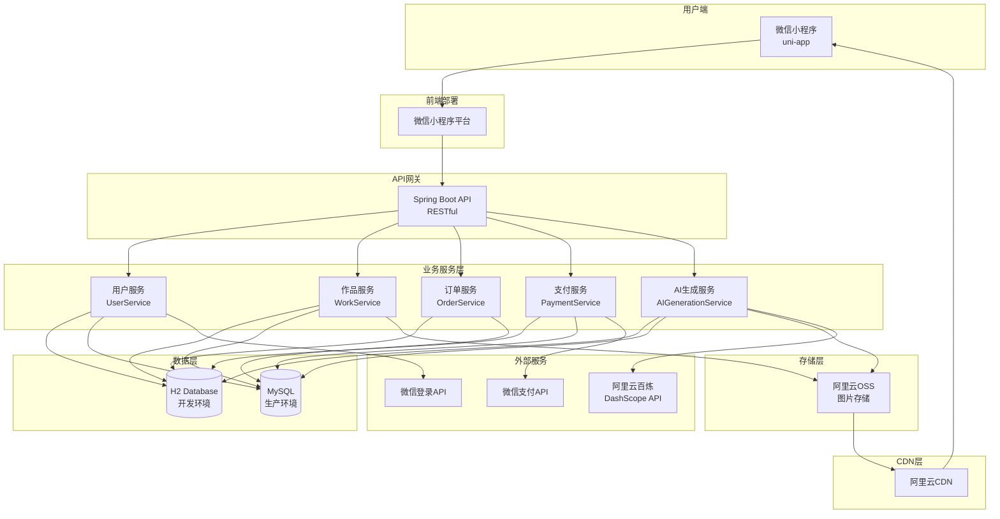
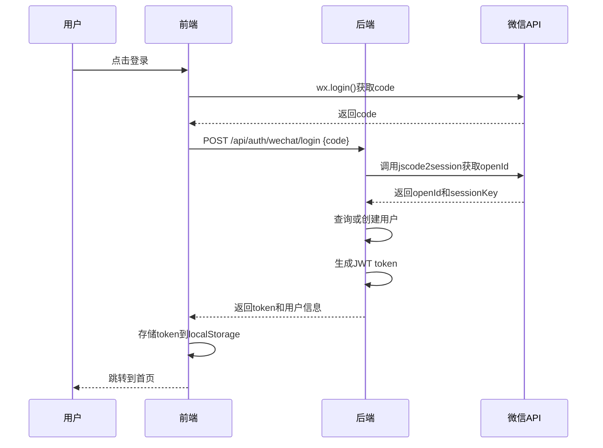
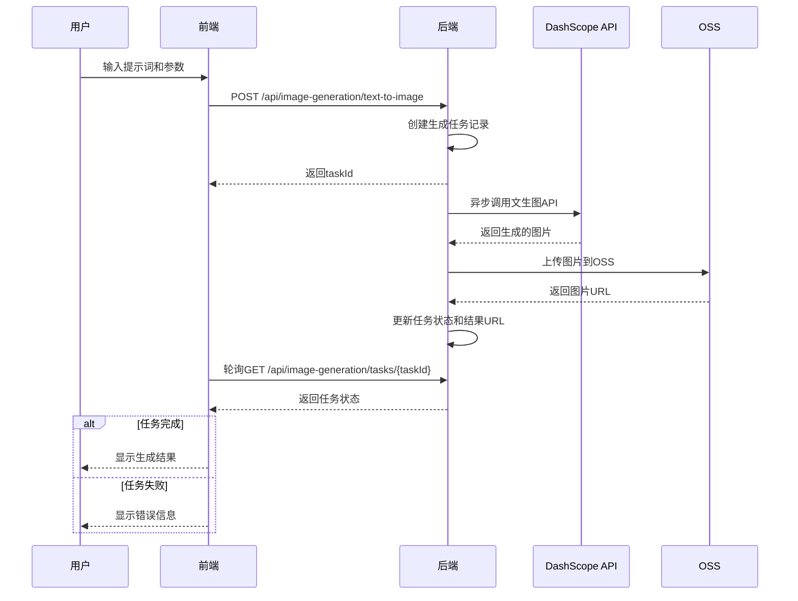
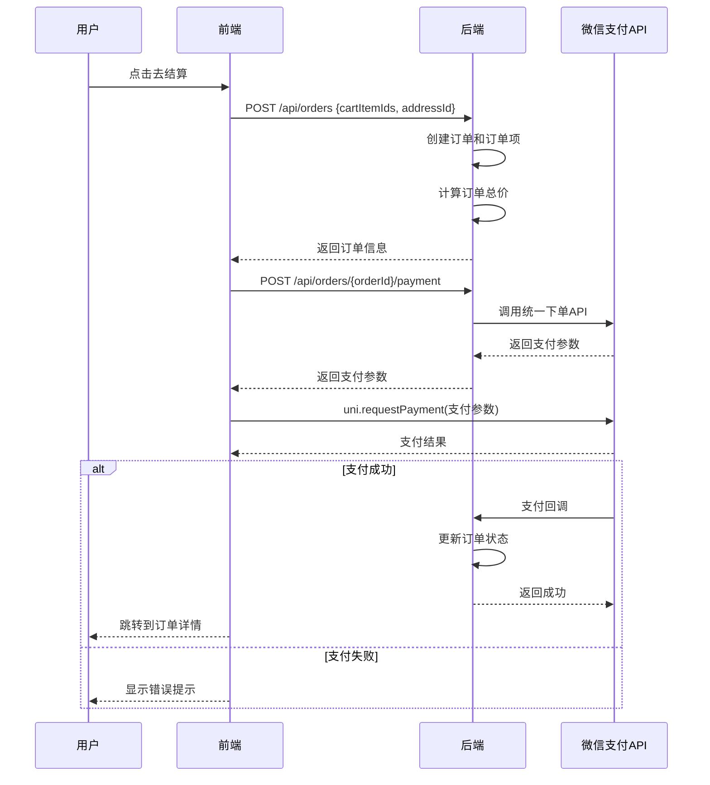
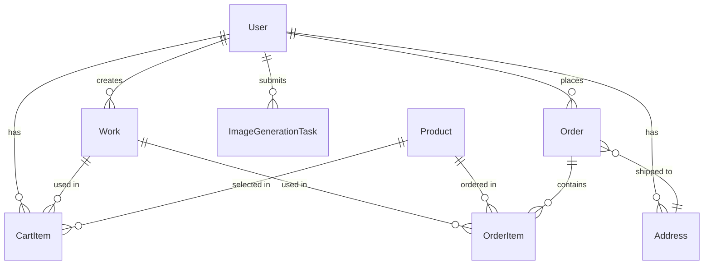

# AI印花电商小程序 Fullstack Architecture Document

## Introduction

本文档概述了AI印花电商小程序的完整全栈架构，包括后端系统、前端实现及其集成。它作为AI驱动开发的单一事实来源，确保整个技术栈的一致性。

本文档基于PRD文档、前端规范文档和功能规划文档创建，重点关注P0和P1功能的技术实现。

### Starter Template or Existing Project

**N/A - Greenfield project**

这是一个全新的项目，使用uni-app + Spring Boot技术栈，不基于任何现有模板。

### Change Log

| Date | Version | Description | Author |
|------|---------|-------------|--------|
| 2024-12-14 | 1.0 | 初始架构文档创建 | Architect |

## High Level Architecture

### Technical Summary

AI印花电商小程序采用前后端分离的架构模式，前端使用uni-app框架开发微信小程序，后端使用Spring Boot构建RESTful API服务。系统采用单体架构（Monolith），便于快速开发和迭代。前端通过HTTPS与后端API通信，使用JWT进行身份认证。图片文件存储在阿里云OSS，通过CDN加速访问。AI图片生成功能通过集成阿里云百炼API实现，采用异步任务队列处理生成请求。数据库使用H2（开发环境），生产环境可迁移到MySQL。整体架构设计简洁高效，支持快速迭代和后续扩展。

### Platform and Infrastructure Choice

**Platform:** 阿里云

**Key Services:**
- **ECS（弹性计算服务）**：部署Spring Boot后端服务
- **OSS（对象存储服务）**：存储用户生成的图片和商品图片
- **CDN（内容分发网络）**：加速图片访问
- **百炼（DashScope）**：AI图片生成服务
- **RDS（可选）**：生产环境MySQL数据库

**Deployment Host and Regions:** 
- 开发环境：本地开发
- 测试环境：阿里云ECS（华东1区）
- 生产环境：阿里云ECS（华东1区）+ OSS（华东1区）

**Rationale:**
- 阿里云提供完整的云服务生态，便于集成
- OSS和CDN提供稳定的文件存储和加速服务
- 百炼API提供稳定的AI图片生成能力
- 成本可控，按量付费

### Repository Structure

**Structure:** Monorepo

**Monorepo Tool:** 不使用专门的monorepo工具，采用简单的目录结构

**Package Organization:**
```
my-shop-cursor/
├── frontend/          # uni-app前端项目
│   ├── pages/        # 页面文件
│   ├── components/   # 组件
│   ├── store/        # 状态管理
│   ├── utils/        # 工具函数
│   └── api/          # API接口封装
├── backend/          # Spring Boot后端项目
│   ├── src/
│   │   └── main/
│   │       ├── java/
│   │       │   └── com/
│   │       │       └── myshop/
│   │       │           ├── controller/  # 控制器
│   │       │           ├── service/     # 业务逻辑
│   │       │           ├── repository/  # 数据访问
│   │       │           ├── entity/      # 实体类
│   │       │           ├── dto/         # 数据传输对象
│   │       │           ├── config/      # 配置类
│   │       │           └── util/        # 工具类
│   │       └── resources/
│   │           ├── application.yml     # 配置文件
│   │           └── db/                 # 数据库脚本
├── docs/            # 项目文档
└── README.md        # 项目说明
```

**Rationale:**
- 前后端代码在同一个仓库，便于统一管理和版本控制
- 简单的目录结构，易于理解和维护
- 便于共享类型定义和工具函数

### High Level Architecture Diagram



### Architectural Patterns

- **前后端分离架构**：前端和后端完全分离，通过RESTful API通信 - _Rationale:_ 便于独立开发、部署和扩展
- **MVC模式（后端）**：Controller处理请求，Service处理业务逻辑，Repository处理数据访问 - _Rationale:_ 清晰的职责分离，易于维护和测试
- **组件化架构（前端）**：使用Vue组件构建可复用的UI组件 - _Rationale:_ 提高代码复用性和可维护性
- **Repository模式**：抽象数据访问层，便于测试和数据库迁移 - _Rationale:_ 解耦业务逻辑和数据访问，支持多数据库
- **异步任务处理**：AI生成任务使用异步处理，不阻塞主线程 - _Rationale:_ 提升用户体验，支持长时间任务
- **RESTful API设计**：遵循REST规范，资源导向的API设计 - _Rationale:_ 标准化接口设计，易于理解和集成

## Tech Stack

### Technology Stack Table

| Category | Technology | Version | Purpose | Rationale |
|----------|-----------|---------|---------|-----------|
| Frontend Language | JavaScript | ES6+ | 前端开发语言 | uni-app支持，生态丰富 |
| Frontend Framework | uni-app | 3.x | 跨平台小程序框架 | 一套代码多端运行，开发效率高 |
| UI Component Library | uView UI | 2.x | UI组件库 | 功能丰富，文档完善 |
| State Management | Pinia | 2.x | 状态管理 | Vue3官方推荐，轻量高效 |
| Backend Language | Java | 17+ | 后端开发语言 | 企业级应用首选，生态成熟 |
| Backend Framework | Spring Boot | 3.0+ | 后端框架 | 快速开发，生态丰富 |
| API Style | REST | - | API设计风格 | 标准化，易于理解和集成 |
| Database | H2 | 2.x | 开发数据库 | 嵌入式，无需额外配置 |
| Database | MySQL | 8.0+ | 生产数据库 | 成熟稳定，性能优秀 |
| ORM Framework | Spring Data JPA | 3.0+ | ORM框架 | 简化数据访问，支持多数据库 |
| Cache | - | - | 缓存（可选） | MVP阶段暂不使用 |
| File Storage | 阿里云OSS | - | 文件存储 | 稳定可靠，CDN加速 |
| AI Service | 阿里云百炼 | - | AI图片生成 | 稳定可靠，开箱即用 |
| Authentication | JWT | - | 身份认证 | 无状态，易于扩展 |
| Payment | 微信支付 | - | 支付服务 | 小程序原生支持 |
| Frontend Testing | Jest | - | 前端单元测试 | 暂不实施，后续添加 |
| Backend Testing | JUnit 5 | 5.x | 后端单元测试 | Spring Boot集成，标准测试框架 |
| E2E Testing | - | - | 端到端测试 | 暂不实施，后续添加 |
| Build Tool | Maven | 3.8+ | 后端构建工具 | Java生态标准 |
| Build Tool | npm | - | 前端包管理 | Node.js生态标准 |
| Bundler | Vite | - | 前端打包工具 | uni-app内置，快速构建 |
| CI/CD | GitHub Actions | - | 持续集成 | 免费，易于配置 |
| Monitoring | - | - | 监控（可选） | MVP阶段暂不使用 |
| Logging | Logback | - | 日志框架 | Spring Boot默认，功能完善 |
| CSS Framework | - | - | CSS框架 | 使用uView UI内置样式 |

## Data Models

### User（用户）

**Purpose:** 存储用户基本信息

**Key Attributes:**
- id: Long - 用户ID，主键
- openId: String - 微信openId，唯一标识
- nickName: String - 用户昵称
- avatarUrl: String - 头像URL
- phone: String - 手机号（可选）
- createTime: LocalDateTime - 创建时间
- updateTime: LocalDateTime - 更新时间

**TypeScript Interface:**
```typescript
interface User {
  id: number;
  openId: string;
  nickName: string;
  avatarUrl: string;
  phone?: string;
  createTime: string;
  updateTime: string;
}
```

**Relationships:**
- 一对多：一个用户有多个作品（Work）
- 一对多：一个用户有多个订单（Order）
- 一对多：一个用户有多个购物车项（CartItem）
- 一对多：一个用户有多个收货地址（Address）

### Work（作品）

**Purpose:** 存储用户生成的图片作品

**Key Attributes:**
- id: Long - 作品ID，主键
- userId: Long - 用户ID，外键
- title: String - 作品标题
- description: String - 作品描述
- imageUrl: String - 作品图片URL（OSS）
- tags: String[] - 作品标签（P1）
- category: String - 作品分类（P1）
- isFavorite: Boolean - 是否收藏（P1）
- createTime: LocalDateTime - 创建时间
- updateTime: LocalDateTime - 更新时间

**TypeScript Interface:**
```typescript
interface Work {
  id: number;
  userId: number;
  title: string;
  description?: string;
  imageUrl: string;
  tags?: string[];
  category?: string;
  isFavorite?: boolean;
  createTime: string;
  updateTime: string;
}
```

**Relationships:**
- 多对一：多个作品属于一个用户（User）
- 一对多：一个作品可以添加到多个购物车项（CartItem）
- 一对多：一个作品可以出现在多个订单项（OrderItem）

### ImageGenerationTask（图片生成任务）

**Purpose:** 跟踪AI图片生成任务的状态

**Key Attributes:**
- id: Long - 任务ID，主键
- userId: Long - 用户ID，外键
- prompt: String - 提示词
- imageUrl: String - 参考图片URL（图生图）
- parameters: String - 生成参数（JSON格式）
- taskType: String - 任务类型（TEXT_TO_IMAGE / IMAGE_TO_IMAGE）
- status: String - 任务状态（PENDING / PROCESSING / COMPLETED / FAILED）
- resultUrl: String - 生成结果图片URL
- errorMessage: String - 错误信息
- createTime: LocalDateTime - 创建时间
- updateTime: LocalDateTime - 更新时间

**TypeScript Interface:**
```typescript
interface ImageGenerationTask {
  id: number;
  userId: number;
  prompt: string;
  imageUrl?: string;
  parameters: string;
  taskType: 'TEXT_TO_IMAGE' | 'IMAGE_TO_IMAGE';
  status: 'PENDING' | 'PROCESSING' | 'COMPLETED' | 'FAILED';
  resultUrl?: string;
  errorMessage?: string;
  createTime: string;
  updateTime: string;
}
```

**Relationships:**
- 多对一：多个任务属于一个用户（User）

### Product（商品）

**Purpose:** 存储包包商品信息

**Key Attributes:**
- id: Long - 商品ID，主键
- name: String - 商品名称
- type: String - 商品类型（手提包、单肩包、双肩包等）
- description: String - 商品描述
- basePrice: BigDecimal - 基础价格
- colors: String[] - 可用颜色列表
- sizes: String[] - 可用尺寸列表
- imageUrl: String - 商品图片URL
- createTime: LocalDateTime - 创建时间
- updateTime: LocalDateTime - 更新时间

**TypeScript Interface:**
```typescript
interface Product {
  id: number;
  name: string;
  type: string;
  description?: string;
  basePrice: number;
  colors: string[];
  sizes: string[];
  imageUrl: string;
  createTime: string;
  updateTime: string;
}
```

**Relationships:**
- 一对多：一个商品可以出现在多个购物车项（CartItem）
- 一对多：一个商品可以出现在多个订单项（OrderItem）

### CartItem（购物车项）

**Purpose:** 存储购物车中的商品项

**Key Attributes:**
- id: Long - 购物车项ID，主键
- userId: Long - 用户ID，外键
- workId: Long - 作品ID，外键
- productId: Long - 商品ID，外键
- color: String - 选择的颜色
- size: String - 选择的尺寸
- quantity: Integer - 数量
- previewImageUrl: String - 预览图片URL
- createTime: LocalDateTime - 创建时间
- updateTime: LocalDateTime - 更新时间

**TypeScript Interface:**
```typescript
interface CartItem {
  id: number;
  userId: number;
  workId: number;
  productId: number;
  color: string;
  size: string;
  quantity: number;
  previewImageUrl: string;
  createTime: string;
  updateTime: string;
}
```

**Relationships:**
- 多对一：多个购物车项属于一个用户（User）
- 多对一：多个购物车项关联一个作品（Work）
- 多对一：多个购物车项关联一个商品（Product）

### Order（订单）

**Purpose:** 存储订单信息

**Key Attributes:**
- id: Long - 订单ID，主键
- userId: Long - 用户ID，外键
- orderNo: String - 订单号，唯一
- status: String - 订单状态（PENDING_PAYMENT / PAID / PROCESSING / SHIPPED / COMPLETED / CANCELLED）
- totalAmount: BigDecimal - 订单总金额
- addressId: Long - 收货地址ID，外键
- paymentStatus: String - 支付状态（UNPAID / PAID / REFUNDED）
- paymentTime: LocalDateTime - 支付时间
- createTime: LocalDateTime - 创建时间
- updateTime: LocalDateTime - 更新时间

**TypeScript Interface:**
```typescript
interface Order {
  id: number;
  userId: number;
  orderNo: string;
  status: 'PENDING_PAYMENT' | 'PAID' | 'PROCESSING' | 'SHIPPED' | 'COMPLETED' | 'CANCELLED';
  totalAmount: number;
  addressId: number;
  paymentStatus: 'UNPAID' | 'PAID' | 'REFUNDED';
  paymentTime?: string;
  createTime: string;
  updateTime: string;
  items: OrderItem[];
}
```

**Relationships:**
- 多对一：多个订单属于一个用户（User）
- 一对多：一个订单包含多个订单项（OrderItem）
- 多对一：多个订单关联一个收货地址（Address）

### OrderItem（订单项）

**Purpose:** 存储订单中的商品项

**Key Attributes:**
- id: Long - 订单项ID，主键
- orderId: Long - 订单ID，外键
- workId: Long - 作品ID，外键
- productId: Long - 商品ID，外键
- color: String - 选择的颜色
- size: String - 选择的尺寸
- quantity: Integer - 数量
- price: BigDecimal - 单价
- previewImageUrl: String - 预览图片URL

**TypeScript Interface:**
```typescript
interface OrderItem {
  id: number;
  orderId: number;
  workId: number;
  productId: number;
  color: string;
  size: string;
  quantity: number;
  price: number;
  previewImageUrl: string;
}
```

**Relationships:**
- 多对一：多个订单项属于一个订单（Order）
- 多对一：多个订单项关联一个作品（Work）
- 多对一：多个订单项关联一个商品（Product）

### Address（收货地址）

**Purpose:** 存储用户收货地址

**Key Attributes:**
- id: Long - 地址ID，主键
- userId: Long - 用户ID，外键
- receiverName: String - 收货人姓名
- receiverPhone: String - 收货人电话
- province: String - 省份
- city: String - 城市
- district: String - 区县
- detail: String - 详细地址
- isDefault: Boolean - 是否默认地址
- createTime: LocalDateTime - 创建时间
- updateTime: LocalDateTime - 更新时间

**TypeScript Interface:**
```typescript
interface Address {
  id: number;
  userId: number;
  receiverName: string;
  receiverPhone: string;
  province: string;
  city: string;
  district: string;
  detail: string;
  isDefault: boolean;
  createTime: string;
  updateTime: string;
}
```

**Relationships:**
- 多对一：多个地址属于一个用户（User）
- 一对多：一个地址可以用于多个订单（Order）

## API Specification

### REST API Specification

基于OpenAPI 3.0规范定义所有API接口。

#### 认证相关

**POST /api/auth/wechat/login**
- 描述：微信登录
- 请求体：`{ code: string }`
- 响应：`{ token: string, user: User }`

**GET /api/auth/me**
- 描述：获取当前用户信息
- 认证：需要JWT Token
- 响应：`{ user: User }`

#### 作品相关

**POST /api/works**
- 描述：保存作品
- 认证：需要JWT Token
- 请求体：`{ title: string, description?: string, imageUrl: string, tags?: string[] }`
- 响应：`{ work: Work }`

**GET /api/works**
- 描述：获取作品列表
- 认证：需要JWT Token
- 查询参数：`page?: number, size?: number, category?: string, tag?: string`
- 响应：`{ works: Work[], total: number }`

**GET /api/works/{workId}**
- 描述：获取作品详情
- 认证：需要JWT Token
- 响应：`{ work: Work }`

**PUT /api/works/{workId}**
- 描述：更新作品信息
- 认证：需要JWT Token
- 请求体：`{ title?: string, description?: string, tags?: string[], category?: string }`
- 响应：`{ work: Work }`

**DELETE /api/works/{workId}**
- 描述：删除作品
- 认证：需要JWT Token
- 响应：`{ success: boolean }`

**PUT /api/works/{workId}/favorite**
- 描述：切换收藏状态（P1）
- 认证：需要JWT Token
- 响应：`{ work: Work }`

#### AI生成相关

**POST /api/image-generation/text-to-image**
- 描述：文生图
- 认证：需要JWT Token
- 请求体：`{ prompt: string, parameters: { size: string, style: string } }`
- 响应：`{ taskId: number }`

**POST /api/image-generation/image-to-image**
- 描述：图生图（P1）
- 认证：需要JWT Token
- 请求体：`{ imageUrl: string, prompt: string, similarity: number }`
- 响应：`{ taskId: number }`

**GET /api/image-generation/tasks/{taskId}**
- 描述：查询生成任务状态
- 认证：需要JWT Token
- 响应：`{ task: ImageGenerationTask }`

#### 商品相关

**GET /api/products**
- 描述：获取商品列表
- 响应：`{ products: Product[] }`

**GET /api/products/{productId}**
- 描述：获取商品详情
- 响应：`{ product: Product }`

#### 购物车相关

**POST /api/cart/items**
- 描述：添加到购物车
- 认证：需要JWT Token
- 请求体：`{ workId: number, productId: number, color: string, size: string, quantity: number, previewImageUrl: string }`
- 响应：`{ cartItem: CartItem }`

**GET /api/cart/items**
- 描述：获取购物车列表
- 认证：需要JWT Token
- 响应：`{ items: CartItem[], totalAmount: number }`

**PUT /api/cart/items/{itemId}**
- 描述：更新购物车项
- 认证：需要JWT Token
- 请求体：`{ quantity?: number, color?: string, size?: string }`
- 响应：`{ cartItem: CartItem }`

**DELETE /api/cart/items/{itemId}**
- 描述：删除购物车项
- 认证：需要JWT Token
- 响应：`{ success: boolean }`

#### 订单相关

**POST /api/orders**
- 描述：创建订单
- 认证：需要JWT Token
- 请求体：`{ cartItemIds: number[], addressId: number }`
- 响应：`{ order: Order }`

**GET /api/orders**
- 描述：获取订单列表（P1）
- 认证：需要JWT Token
- 查询参数：`page?: number, size?: number, status?: string`
- 响应：`{ orders: Order[], total: number }`

**GET /api/orders/{orderId}**
- 描述：获取订单详情
- 认证：需要JWT Token
- 响应：`{ order: Order }`

**POST /api/orders/{orderId}/payment**
- 描述：创建支付订单
- 认证：需要JWT Token
- 响应：`{ paymentParams: { appId, timeStamp, nonceStr, package, signType, paySign } }`

**POST /api/payment/notify**
- 描述：微信支付回调
- 请求体：微信支付回调数据
- 响应：`{ success: boolean }`

#### 地址相关（P1）

**POST /api/addresses**
- 描述：添加收货地址
- 认证：需要JWT Token
- 请求体：`{ receiverName: string, receiverPhone: string, province: string, city: string, district: string, detail: string, isDefault?: boolean }`
- 响应：`{ address: Address }`

**GET /api/addresses**
- 描述：获取地址列表
- 认证：需要JWT Token
- 响应：`{ addresses: Address[] }`

**PUT /api/addresses/{addressId}**
- 描述：更新地址
- 认证：需要JWT Token
- 请求体：同添加地址
- 响应：`{ address: Address }`

**DELETE /api/addresses/{addressId}**
- 描述：删除地址
- 认证：需要JWT Token
- 响应：`{ success: boolean }`

#### 用户相关（P1）

**PUT /api/user/profile**
- 描述：更新用户信息
- 认证：需要JWT Token
- 请求体：`{ nickName?: string, avatarUrl?: string, phone?: string }`
- 响应：`{ user: User }`

**GET /api/user/statistics**
- 描述：获取用户统计信息
- 认证：需要JWT Token
- 响应：`{ orderCount: number, pendingPaymentCount: number, pendingReceiptCount: number, workCount: number, favoriteCount: number }`

## Components

### Frontend Components

#### 1. API Service Layer

**Responsibility:** 封装所有后端API调用

**Key Interfaces:**
- `authApi.login(code: string): Promise<LoginResponse>`
- `workApi.getWorks(params): Promise<Work[]>`
- `workApi.saveWork(work: Work): Promise<Work>`
- `orderApi.createOrder(data): Promise<Order>`
- `paymentApi.createPayment(orderId): Promise<PaymentParams>`

**Dependencies:** 
- HTTP客户端（基于uni.request封装）
- Token管理（从localStorage读取）

**Technology Stack:** TypeScript, uni-app

#### 2. State Management (Pinia)

**Responsibility:** 管理全局应用状态

**Key Stores:**
- `userStore`: 用户信息、登录状态
- `workStore`: 作品列表、当前作品
- `cartStore`: 购物车状态
- `orderStore`: 订单状态

**Dependencies:** Pinia

**Technology Stack:** Pinia, TypeScript

#### 3. UI Components

**Responsibility:** 可复用的UI组件

**Key Components:**
- `WorkCard`: 作品卡片
- `ProductCard`: 商品卡片
- `Loading`: 加载组件
- `Modal`: 模态框
- `ImagePicker`: 图片选择器

**Dependencies:** uView UI

**Technology Stack:** Vue 3, uView UI

### Backend Components

#### 1. Controller Layer

**Responsibility:** 处理HTTP请求，参数验证，响应格式化

**Key Controllers:**
- `AuthController`: 认证相关接口
- `WorkController`: 作品相关接口
- `OrderController`: 订单相关接口
- `PaymentController`: 支付相关接口

**Dependencies:** Spring Web, Service Layer

**Technology Stack:** Spring Boot, Java

#### 2. Service Layer

**Responsibility:** 业务逻辑处理

**Key Services:**
- `UserService`: 用户业务逻辑
- `WorkService`: 作品业务逻辑
- `OrderService`: 订单业务逻辑
- `PaymentService`: 支付业务逻辑
- `AIGenerationService`: AI生成业务逻辑
- `OssService`: OSS文件存储业务逻辑

**Dependencies:** Repository Layer, External Services

**Technology Stack:** Spring Boot, Java

#### 3. Repository Layer

**Responsibility:** 数据访问抽象

**Key Repositories:**
- `UserRepository`: 用户数据访问
- `WorkRepository`: 作品数据访问
- `OrderRepository`: 订单数据访问
- `ProductRepository`: 商品数据访问

**Dependencies:** Spring Data JPA, Database

**Technology Stack:** Spring Data JPA, H2/MySQL

#### 4. External Service Integration

**Responsibility:** 集成外部服务

**Key Integrations:**
- `DashScopeClient`: 阿里云百炼API客户端
- `OssClient`: 阿里云OSS客户端
- `WeChatPayClient`: 微信支付客户端
- `WeChatAuthClient`: 微信登录客户端

**Dependencies:** 外部SDK

**Technology Stack:** Java, 阿里云SDK, 微信SDK

## External APIs

### 阿里云百炼（DashScope）API

- **Purpose:** AI图片生成服务
- **Documentation:** https://help.aliyun.com/document_detail/2403419.html
- **Base URL(s):** https://dashscope.aliyuncs.com
- **Authentication:** API Key（配置在环境变量）
- **Rate Limits:** 根据套餐限制

**Key Endpoints Used:**
- `POST /api/v1/services/aigc/text2image/image-synthesis` - 文生图
- `POST /api/v1/services/aigc/image-generation/generation` - 图生图

**Integration Notes:**
- 使用官方Java SDK
- 异步调用，不阻塞主线程
- 错误处理和重试机制
- 成本控制（限制调用频率）

### 阿里云OSS API

- **Purpose:** 文件存储服务
- **Documentation:** https://help.aliyun.com/product/31815.html
- **Base URL(s):** 根据区域配置（如：https://oss-cn-shanghai.aliyuncs.com）
- **Authentication:** AccessKey ID和AccessKey Secret
- **Rate Limits:** 无限制

**Key Endpoints Used:**
- 文件上传：使用OSS SDK直接上传
- 文件访问：通过CDN域名访问

**Integration Notes:**
- 使用官方Java SDK
- 支持前端直传（生成签名URL）
- 图片处理（缩放、裁剪等）
- CDN加速访问

### 微信支付API

- **Purpose:** 支付服务
- **Documentation:** https://pay.weixin.qq.com/wiki/doc/apiv3/index.shtml
- **Base URL(s):** https://api.mch.weixin.qq.com
- **Authentication:** 商户证书和API密钥
- **Rate Limits:** 根据商户等级

**Key Endpoints Used:**
- `POST /v3/pay/transactions/jsapi` - 统一下单
- `POST /v3/pay/transactions/out-trade-no/{out_trade_no}/close` - 关闭订单

**Integration Notes:**
- 使用官方Java SDK
- 支付回调验签
- 订单状态同步
- 错误处理和重试

### 微信登录API

- **Purpose:** 用户身份认证
- **Documentation:** https://developers.weixin.qq.com/miniprogram/dev/api-backend/open-api/login/auth.code2Session.html
- **Base URL(s):** https://api.weixin.qq.com
- **Authentication:** AppID和AppSecret
- **Rate Limits:** 无限制

**Key Endpoints Used:**
- `GET /sns/jscode2session` - 通过code获取openId和sessionKey

**Integration Notes:**
- 直接HTTP调用
- 错误处理
- 安全考虑（AppSecret保密）

## Core Workflows

### Workflow 1: 用户登录流程



### Workflow 2: AI图片生成流程



### Workflow 3: 订单创建和支付流程



## Database Schema

### ER Diagram



### Table Definitions

#### users
```sql
CREATE TABLE users (
    id BIGINT PRIMARY KEY AUTO_INCREMENT,
    open_id VARCHAR(100) UNIQUE NOT NULL,
    nick_name VARCHAR(100),
    avatar_url VARCHAR(500),
    phone VARCHAR(20),
    create_time TIMESTAMP DEFAULT CURRENT_TIMESTAMP,
    update_time TIMESTAMP DEFAULT CURRENT_TIMESTAMP ON UPDATE CURRENT_TIMESTAMP
);
```

#### works
```sql
CREATE TABLE works (
    id BIGINT PRIMARY KEY AUTO_INCREMENT,
    user_id BIGINT NOT NULL,
    title VARCHAR(200) NOT NULL,
    description TEXT,
    image_url VARCHAR(500) NOT NULL,
    tags VARCHAR(500), -- JSON array
    category VARCHAR(50),
    is_favorite BOOLEAN DEFAULT FALSE,
    create_time TIMESTAMP DEFAULT CURRENT_TIMESTAMP,
    update_time TIMESTAMP DEFAULT CURRENT_TIMESTAMP ON UPDATE CURRENT_TIMESTAMP,
    FOREIGN KEY (user_id) REFERENCES users(id)
);
```

#### image_generation_tasks
```sql
CREATE TABLE image_generation_tasks (
    id BIGINT PRIMARY KEY AUTO_INCREMENT,
    user_id BIGINT NOT NULL,
    prompt TEXT NOT NULL,
    image_url VARCHAR(500),
    parameters TEXT, -- JSON
    task_type VARCHAR(50) NOT NULL,
    status VARCHAR(50) NOT NULL,
    result_url VARCHAR(500),
    error_message TEXT,
    create_time TIMESTAMP DEFAULT CURRENT_TIMESTAMP,
    update_time TIMESTAMP DEFAULT CURRENT_TIMESTAMP ON UPDATE CURRENT_TIMESTAMP,
    FOREIGN KEY (user_id) REFERENCES users(id)
);
```

#### products
```sql
CREATE TABLE products (
    id BIGINT PRIMARY KEY AUTO_INCREMENT,
    name VARCHAR(200) NOT NULL,
    type VARCHAR(50) NOT NULL,
    description TEXT,
    base_price DECIMAL(10,2) NOT NULL,
    colors VARCHAR(500), -- JSON array
    sizes VARCHAR(500), -- JSON array
    image_url VARCHAR(500),
    create_time TIMESTAMP DEFAULT CURRENT_TIMESTAMP,
    update_time TIMESTAMP DEFAULT CURRENT_TIMESTAMP ON UPDATE CURRENT_TIMESTAMP
);
```

#### cart_items
```sql
CREATE TABLE cart_items (
    id BIGINT PRIMARY KEY AUTO_INCREMENT,
    user_id BIGINT NOT NULL,
    work_id BIGINT NOT NULL,
    product_id BIGINT NOT NULL,
    color VARCHAR(50) NOT NULL,
    size VARCHAR(50) NOT NULL,
    quantity INT NOT NULL DEFAULT 1,
    preview_image_url VARCHAR(500),
    create_time TIMESTAMP DEFAULT CURRENT_TIMESTAMP,
    update_time TIMESTAMP DEFAULT CURRENT_TIMESTAMP ON UPDATE CURRENT_TIMESTAMP,
    FOREIGN KEY (user_id) REFERENCES users(id),
    FOREIGN KEY (work_id) REFERENCES works(id),
    FOREIGN KEY (product_id) REFERENCES products(id)
);
```

#### orders
```sql
CREATE TABLE orders (
    id BIGINT PRIMARY KEY AUTO_INCREMENT,
    user_id BIGINT NOT NULL,
    order_no VARCHAR(50) UNIQUE NOT NULL,
    status VARCHAR(50) NOT NULL,
    total_amount DECIMAL(10,2) NOT NULL,
    address_id BIGINT,
    payment_status VARCHAR(50) NOT NULL,
    payment_time TIMESTAMP,
    create_time TIMESTAMP DEFAULT CURRENT_TIMESTAMP,
    update_time TIMESTAMP DEFAULT CURRENT_TIMESTAMP ON UPDATE CURRENT_TIMESTAMP,
    FOREIGN KEY (user_id) REFERENCES users(id),
    FOREIGN KEY (address_id) REFERENCES addresses(id)
);
```

#### order_items
```sql
CREATE TABLE order_items (
    id BIGINT PRIMARY KEY AUTO_INCREMENT,
    order_id BIGINT NOT NULL,
    work_id BIGINT NOT NULL,
    product_id BIGINT NOT NULL,
    color VARCHAR(50) NOT NULL,
    size VARCHAR(50) NOT NULL,
    quantity INT NOT NULL,
    price DECIMAL(10,2) NOT NULL,
    preview_image_url VARCHAR(500),
    FOREIGN KEY (order_id) REFERENCES orders(id),
    FOREIGN KEY (work_id) REFERENCES works(id),
    FOREIGN KEY (product_id) REFERENCES products(id)
);
```

#### addresses
```sql
CREATE TABLE addresses (
    id BIGINT PRIMARY KEY AUTO_INCREMENT,
    user_id BIGINT NOT NULL,
    receiver_name VARCHAR(100) NOT NULL,
    receiver_phone VARCHAR(20) NOT NULL,
    province VARCHAR(50) NOT NULL,
    city VARCHAR(50) NOT NULL,
    district VARCHAR(50) NOT NULL,
    detail VARCHAR(200) NOT NULL,
    is_default BOOLEAN DEFAULT FALSE,
    create_time TIMESTAMP DEFAULT CURRENT_TIMESTAMP,
    update_time TIMESTAMP DEFAULT CURRENT_TIMESTAMP ON UPDATE CURRENT_TIMESTAMP,
    FOREIGN KEY (user_id) REFERENCES users(id)
);
```

## Security Considerations

### Authentication & Authorization

1. **JWT Token认证**
   - Token存储在localStorage
   - Token包含用户ID和基本信息
   - Token过期时间：7天
   - 支持Token刷新（可选）

2. **API安全**
   - 所有API使用HTTPS
   - 需要认证的接口验证JWT Token
   - 接口参数验证和过滤
   - SQL注入防护（使用JPA参数化查询）

3. **微信登录安全**
   - AppSecret存储在服务器端，不暴露给前端
   - 验证code的有效性
   - 防止重放攻击

### Data Protection

1. **敏感数据加密**
   - 用户手机号加密存储（可选）
   - 支付信息不存储，仅传递

2. **数据访问控制**
   - 用户只能访问自己的数据
   - 订单、作品等数据验证用户所有权

3. **OSS安全**
   - 使用签名URL控制访问
   - 设置合理的访问权限
   - 防止恶意上传

### Payment Security

1. **支付安全**
   - 支付参数签名验证
   - 支付回调验签
   - 订单状态幂等性处理
   - 防止重复支付

## Performance Considerations

### Frontend Performance

1. **图片优化**
   - 使用懒加载
   - 图片压缩和格式优化
   - CDN加速

2. **代码优化**
   - 代码分割和按需加载
   - 减少包大小
   - 使用缓存策略

3. **网络优化**
   - 请求合并
   - 防抖和节流
   - 离线缓存

### Backend Performance

1. **数据库优化**
   - 添加必要的索引
   - 查询优化
   - 连接池配置

2. **API优化**
   - 响应缓存（可选）
   - 异步处理长时间任务
   - 分页查询

3. **外部服务优化**
   - 异步调用AI生成API
   - OSS直传减少服务器压力
   - 请求重试和降级

## Deployment Strategy

### Development Environment

- **前端：** 微信开发者工具本地运行
- **后端：** 本地Spring Boot应用，H2内存数据库
- **存储：** 本地文件或测试OSS bucket

### Testing Environment

- **前端：** 微信小程序测试版本
- **后端：** 阿里云ECS部署，H2文件数据库
- **存储：** 测试OSS bucket

### Production Environment

- **前端：** 微信小程序正式版本
- **后端：** 阿里云ECS部署，MySQL数据库
- **存储：** 生产OSS bucket + CDN
- **监控：** 应用日志和错误监控（可选）

### CI/CD Pipeline

1. **代码提交** → GitHub
2. **自动构建** → GitHub Actions
3. **运行测试** → 单元测试和集成测试
4. **构建镜像** → Docker镜像（可选）
5. **部署** → 自动部署到测试/生产环境

## Next Steps

### Immediate Actions

1. 创建前后端项目结构
2. 配置开发环境
3. 实现基础框架和配置
4. 开始Epic 1的开发

### Architecture Handoff Checklist

- [x] 技术栈已确定
- [x] 数据模型已设计
- [x] API接口已定义
- [x] 组件架构已规划
- [x] 外部服务集成方案已确定
- [x] 安全考虑已覆盖
- [x] 性能优化策略已制定
- [x] 部署方案已规划

